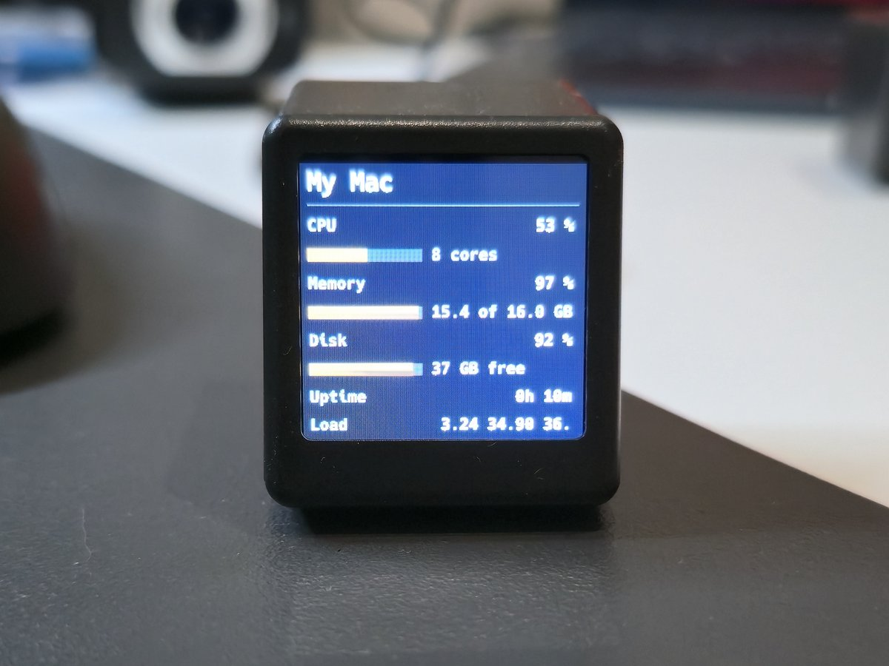
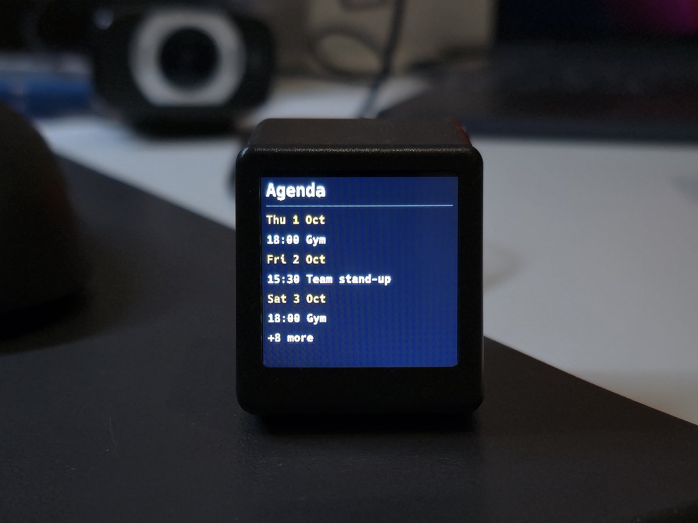
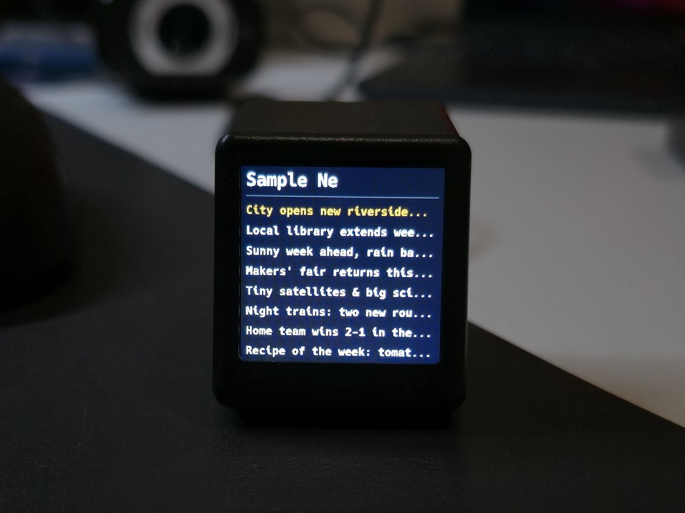

# smalltv-ultra

Alternative firmware for the **GeekMagic SmallTV Ultra** (ESP8266 / ESP-12F, 4 MB flash, ST7789 240×240
display). It turns the device into a small desk clock — time, weather, forecast, a photo album and screens pushed
from another computer — built on top of a rescue core whose one job is to make sure **the device can always
receive a new firmware image over Wi-Fi**.

> **Disclaimer.** This is a personal experiment, not a product. No warranty. You can brick your device. Recovery
> requires the built-in web updater; if the device does not boot, you need to open it and use a UART adapter.
> No support is offered. **Read the full [DISCLAIMER](DISCLAIMER.md) before downloading anything.**
>
> This project is not affiliated with or endorsed by GeekMagic. Installing it replaces the factory firmware, and
> the factory firmware is **not** distributed here: if you want to go back to it one day, you need your own copy.

## Read this before you flash anything

- **The device has no accessible serial port.** The USB-C connector only provides power; the serial pads are
  inside the case. The web updater is the only way in and the only way back.
- **Every unit shares the same public credentials, compiled into the firmware:** web user `admin`, password
  `12345678`; the device's own Wi-Fi access point uses the same password. The only exception is the short-lived
  jailbreak image, whose web password is `kapifo` (see [Quick start](#quick-start)). They cannot be changed without
  rebuilding the firmware. Anyone within reach of the access point, or on your local network, can open the page
  and upload firmware.
- **Do not expose this device to the internet.** No port forwarding, no public IP. It speaks plain HTTP only.
- No cloud, no account, no telemetry. The device only reaches out to fetch weather data (Open-Meteo) and to set
  its clock over NTP.

## Features

| Feature | Screenshot |
|---|---|
| **Clock** — large digits, date, 24-hour or 12-hour format, POSIX time zone, optional blinking colon. Time from NTP, or from the weather server if your network blocks NTP |   |
| **Current weather** from Open-Meteo, Celsius or Fahrenheit, city search by name |  |
| **Forecast** for the next days |  |
| **Photo album** — photos and animated GIFs, converted in your browser (the device never decodes JPG or GIF) |  |
| **Panels** — screens composed by a program on your computer (text rows, label/value pairs, gauges or an image) | see [below](#screens-you-can-push-from-your-pc) |
| **Web settings page** — brightness, night dimming, which screens rotate, time, weather, device health |  |
| **Hand detection** (experimental, off by default) — hold your hand over the base of the device for 2-3 s to dim/brighten, change screen, show your panels or turn the screen off. It works by noticing that your hand blocks the Wi-Fi signal: better with a good signal, about one false alarm per hour, and a live indicator on the web page to check it. Includes a 180° display rotation |  |
| **Rescue mode** — a minimal mode that only serves the web page and the updater |  |

Full description: [docs/03-features.md](docs/03-features.md).

### Screens you can push from your PC

None of these is built into the firmware. They are **panels**: a small program on your computer gathers the data,
composes the screen and sends it; the device only draws it. The ones below come from the example programs in
[`clients/node/`](clients/node/) (sample data), and you can write your own in a few lines — see
[docs/05-pc-apps.md](docs/05-pc-apps.md).

| CPU, memory and disk | Today's agenda | News headlines | Server monitor |
|---|---|---|---|
|  |  |  |  |
| `pc-stats.mjs` | `agenda-ics.mjs` (any `.ics` calendar) | `news-rss.mjs` (any RSS or Atom feed) | a few lines with the `Panel` builder of `smalltv.mjs` |

The same panels on a real device, sent from a laptop:

| CPU, memory and disk | Agenda | News |
|---|---|---|
|  |  |  |

**Data sources.** [Weather data by Open-Meteo.com](https://open-meteo.com/) (CC BY 4.0). City search uses the
Open-Meteo geocoding API, based on [GeoNames](https://www.geonames.org/) (CC BY 4.0).

## Quick start

Installing takes **two images, one after the other**: first a small *jailbreak* image (the only one the factory
firmware accepts), then the real application. Each one has **its own login**, and that is the step where most
people get stuck:

| Stage | File | Wi-Fi access point | Web page login |
|---|---|---|---|
| Factory firmware | — | — (it joins your Wi-Fi) | none |
| **A. Jailbreak** (temporary) | `smalltv-ultra-jailbreak-v0.1.2.bin` | `SmallTV-Setup-<chip-id>`, password `12345678` | user `admin`, password **`kapifo`** |
| **B. Application** (final) | `smalltv-ultra-v0.6.10.bin` | `SmallTV-Setup-<chip-id>`, password `12345678` | user `admin`, password **`12345678`** |

All passwords are lowercase. **Phones capitalise the first letter on their own** (`Admin`, `Kapifo`): if the login
is refused, check that first. Before uploading any file, compare its MD5 with the README of its folder in
[`firmware/`](firmware/).

**A. Jailbreak** → full guide: [docs/01-jailbreak.md](docs/01-jailbreak.md)

1. With the device on your Wi-Fi, open `http://<device-address>/update` (the factory update page; find the address
   in your router's client list).
2. Upload `smalltv-ultra-jailbreak-v0.1.2.bin` from [`firmware/jailbreak/`](firmware/jailbreak/) in the
   *firmware* field, from a browser or with
   `curl -F "firmware=@smalltv-ultra-jailbreak-v0.1.2.bin" "http://<device-address>/update"`.
   It answers *Update Success! Rebooting...* and restarts.

**Between A and B: the device leaves your network.** This is expected. The jailbreak image does not know your
Wi-Fi, so after the restart **nothing answers at the old address**. To reach it again:

3. Join its own access point **`SmallTV-Setup-<chip-id>`** with password `12345678`. The `<chip-id>` is the last
   six hex digits of the device's MAC address, in lowercase: a MAC ending in `…:12:ab:34` gives
   `SmallTV-Setup-12ab34`. The screen also shows the name (if it stays black, the access point still works).
4. Open **`http://192.168.4.1/`** and log in with **`admin` / `kapifo`**. The page is in Spanish (see step 6).
5. On that page, join your home Wi-Fi (*Conectar a tu Wi-Fi* → *Buscar redes* → *Conectar y guardar*). The device comes back on your network (usually at the same address; the
   page shows it) and keeps its access point too. You can skip this and do step 6 from the access point.

**B. Application** → full guide: [docs/02-install-firmware.md](docs/02-install-firmware.md)

6. On the same page (still the jailbreak, still `kapifo`), upload `smalltv-ultra-v0.6.10.bin` from
   [`firmware/v0.6.10/`](firmware/v0.6.10/) and type its MD5 when asked. The jailbreak page is **in Spanish**, because that
   image is frozen and never rebuilt: open *Actualizar el firmware*, choose the file, fill *MD5 del archivo* and press
   *Verificar y actualizar*; a good upload answers *Verificado; reiniciando*. The device comes back in about 15 seconds, keeping your Wi-Fi.
7. **From now on the login is `admin` / `12345678`.** If the browser keeps offering `kapifo`, open the page in a
   private window.
8. **Add the resources** (fonts and icons). In *Advanced → Internal storage* press *Format the storage* if the page
   says the storage is not formatted (usual on a unit that comes from the factory firmware), then upload `smalltv-ultra-resources.res` from the same
   folder through *Advanced → Update the firmware*. `GET /api/app/health` shows `"missing": []` when everything is
   there; the list refreshes as the screens rotate, so give it about a minute.
9. **Optional: change the language.** The device speaks English. For Spanish, French or Italian, upload one
   `smalltv-ultra-lang-<code>.res` from the same folder, the same way as the resource pack. Details:
   [docs/03-features.md](docs/03-features.md#languages).
10. Choose your city, time zone and screens. Later updates are just step 6 again, from the application's own page:
   they keep your resources and settings.

## Documentation

| Document | What it covers |
|---|---|
| [docs/01-jailbreak.md](docs/01-jailbreak.md) | Getting from the factory firmware to the bridge image |
| [docs/02-install-firmware.md](docs/02-install-firmware.md) | Installing and updating the application and the resource pack |
| [docs/03-features.md](docs/03-features.md) | What the firmware does |
| [docs/04-recovery.md](docs/04-recovery.md) | Rescue mode, and what cannot be recovered without a UART adapter |
| [docs/05-pc-apps.md](docs/05-pc-apps.md) | Sending screens and panels from your computer |
| [docs/troubleshooting.md](docs/troubleshooting.md) | Common problems |
| [docs/api/API.md](docs/api/API.md) | HTTP API reference |
| [docs/api/PANEL-API.md](docs/api/PANEL-API.md) | Panel format and endpoints |
| [docs/api/ALBUM-API.md](docs/api/ALBUM-API.md) | Uploading album images from a script |

## Repository layout

- [`firmware/`](firmware/) — the jailbreak (bridge) image and each application release, with MD5 checksums.
- [`clients/`](clients/) — example programs that send screens to the device:
  [`mac/`](clients/mac/) (shell scripts), [`windows/`](clients/windows/) (PowerShell),
  [`node/`](clients/node/) (Node.js).
- [`docs/`](docs/) — the documentation above.

Only binaries and documentation are published here; the firmware source code is not part of this repository.

## Support the project

If you find this useful, you can **[buy me a coffee](https://buymeacoffee.com/u1pns)**. Thank you.

## License

MIT — see [LICENSE](LICENSE). Terms of use and limitation of liability: [DISCLAIMER.md](DISCLAIMER.md). Third-party components: [THIRD-PARTY-NOTICES.md](THIRD-PARTY-NOTICES.md).
