# smalltv-ultra

Alternative firmware for the **GeekMagic SmallTV Ultra** (ESP8266 / ESP-12F, 4 MB flash, ST7789 240×240
display). It turns the device into a small desk clock — time, weather, forecast, a photo album and screens pushed
from another computer — built on top of a rescue core whose one job is to make sure **the device can always
receive a new firmware image over Wi-Fi**.

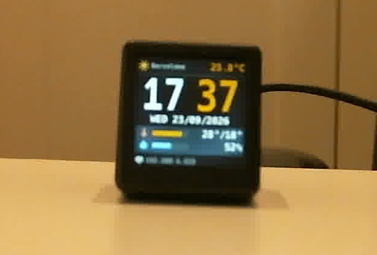

> **Disclaimer.** This is a personal experiment, not a product. No warranty. You can brick your device. Recovery
> requires the built-in web updater; if the device does not boot, you need to open it and use a UART adapter.
> No support is offered. **Read the full [DISCLAIMER](DISCLAIMER.md) before downloading anything.**
>
> This project is not affiliated with or endorsed by GeekMagic. Installing it replaces the factory firmware, and
> the factory firmware is **not** distributed here: if you want to go back to it one day, you need your own copy.

## Read this before you flash anything

- **The device has no accessible serial port.** The USB-C connector only provides power; the serial pads are
  inside the case. The web updater is the only way in and the only way back.
- **Every unit shares the same public credentials, compiled into the firmware:** web user `admin`, password
  `12345678`; the device's own Wi-Fi access point uses the same password. They cannot be changed without
  rebuilding the firmware. Anyone within reach of the access point, or on your local network, can open the page
  and upload firmware.
- **Do not expose this device to the internet.** No port forwarding, no public IP. It speaks plain HTTP only.
- No cloud, no account, no telemetry. The device only reaches out to fetch weather data (Open-Meteo) and to set
  its clock over NTP.

## Features

| Feature | Screenshot |
|---|---|
| **Clock** — large digits, date, 24-hour or 12-hour format, POSIX time zone, optional blinking colon. Time from NTP, or from the weather server if your network blocks NTP | 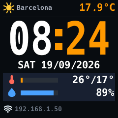 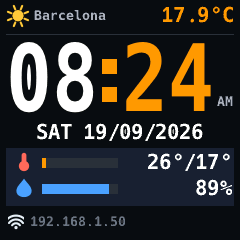 |
| **Current weather** from Open-Meteo, Celsius or Fahrenheit, city search by name | 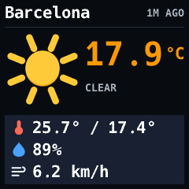 |
| **Forecast** for the next days | 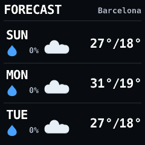 |
| **Photo album** — photos and animated GIFs, converted in your browser (the device never decodes JPG or GIF) | 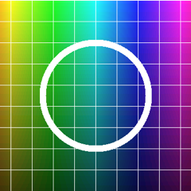 |
| **Panels** — screens composed by a program on your computer (text rows, label/value pairs, gauges or an image) | see [below](#screens-you-can-push-from-your-pc) |
| **Web settings page** — brightness, night dimming, which screens rotate, time, weather, device health | 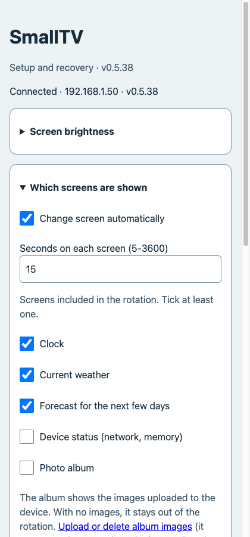 |
| **Hand detection** (experimental, off by default) — hold your hand over the base of the device for 2-3 s to dim/brighten, change screen, show your panels or turn the screen off. It works by noticing that your hand blocks the Wi-Fi signal: better with a good signal, about one false alarm per hour, and a live indicator on the web page to check it. Includes a 180° display rotation | 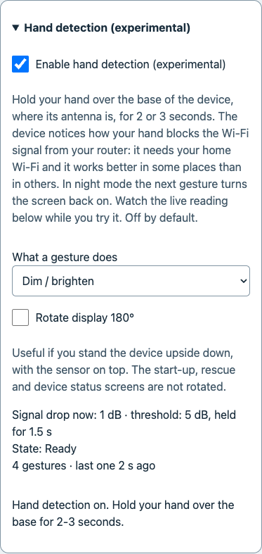 |
| **Rescue mode** — a minimal mode that only serves the web page and the updater | 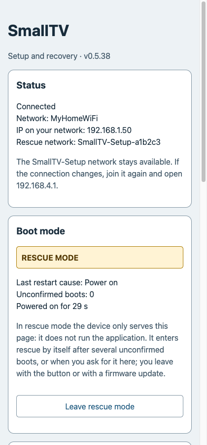 |

Full description: [docs/03-features.md](docs/03-features.md).

### Screens you can push from your PC

None of these is built into the firmware. They are **panels**: a small program on your computer gathers the data,
composes the screen and sends it; the device only draws it. The ones below come from the example programs in
[`clients/node/`](clients/node/) (sample data), and you can write your own in a few lines — see
[docs/05-pc-apps.md](docs/05-pc-apps.md).

| CPU, memory and disk | Today's agenda | News headlines | Server monitor |
|---|---|---|---|
| 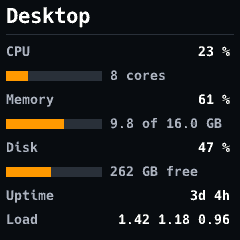 | 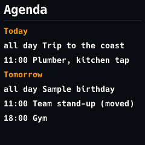 | 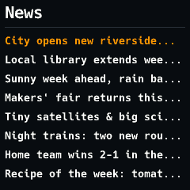 | 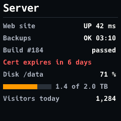 |
| `pc-stats.mjs` | `agenda-ics.mjs` (any `.ics` calendar) | `news-rss.mjs` (any RSS or Atom feed) | a few lines with the `Panel` builder of `smalltv.mjs` |

The news panel, sent from a laptop to a real device:

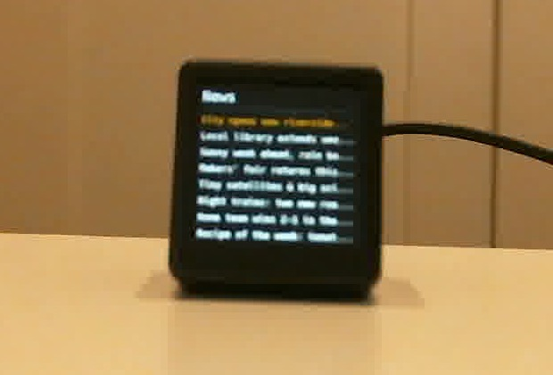

**Data sources.** [Weather data by Open-Meteo.com](https://open-meteo.com/) (CC BY 4.0). City search uses the
Open-Meteo geocoding API, based on [GeoNames](https://www.geonames.org/) (CC BY 4.0).

## Quick start

1. **Jailbreak.** From the factory firmware's own update page, upload the bridge image from
   [`firmware/jailbreak/`](firmware/jailbreak/). Use a browser or `curl -F`. → [docs/01-jailbreak.md](docs/01-jailbreak.md)
2. **Connect.** Join the access point `SmallTV-Setup-<chip-id>`, open the device's page and give it your home
   Wi-Fi.
3. **Install the firmware.** Upload the application `.bin` from [`firmware/v0.6.5/`](firmware/v0.6.5/) through
   the same page. → [docs/02-install-firmware.md](docs/02-install-firmware.md)
4. **Add the resources.** Format the internal storage once, then upload the `.res` resource pack (fonts and
   icons) from the same folder.
5. **Log in** to `http://<device-address>/` with `admin` / `12345678` and choose your city, time zone and
   screens.

Before uploading anything, check the MD5 listed in the firmware folder's README.

## Documentation

| Document | What it covers |
|---|---|
| [docs/01-jailbreak.md](docs/01-jailbreak.md) | Getting from the factory firmware to the bridge image |
| [docs/02-install-firmware.md](docs/02-install-firmware.md) | Installing and updating the application and the resource pack |
| [docs/03-features.md](docs/03-features.md) | What the firmware does |
| [docs/04-recovery.md](docs/04-recovery.md) | Rescue mode, and what cannot be recovered without a UART adapter |
| [docs/05-pc-apps.md](docs/05-pc-apps.md) | Sending screens and panels from your computer |
| [docs/troubleshooting.md](docs/troubleshooting.md) | Common problems |
| [docs/api/API.md](docs/api/API.md) | HTTP API reference |
| [docs/api/PANEL-API.md](docs/api/PANEL-API.md) | Panel format and endpoints |
| [docs/api/ALBUM-API.md](docs/api/ALBUM-API.md) | Uploading album images from a script |

## Repository layout

- [`firmware/`](firmware/) — the jailbreak (bridge) image and each application release, with MD5 checksums.
- [`clients/`](clients/) — example programs that send screens to the device:
  [`mac/`](clients/mac/) (shell scripts), [`windows/`](clients/windows/) (PowerShell),
  [`node/`](clients/node/) (Node.js).
- [`docs/`](docs/) — the documentation above.

Only binaries and documentation are published here; the firmware source code is not part of this repository.

## Support the project

If you find this useful, you can **[buy me a coffee](https://buymeacoffee.com/u1pns)**. Thank you.

## License

MIT — see [LICENSE](LICENSE). Terms of use and limitation of liability: [DISCLAIMER.md](DISCLAIMER.md). Third-party components: [THIRD-PARTY-NOTICES.md](THIRD-PARTY-NOTICES.md).
